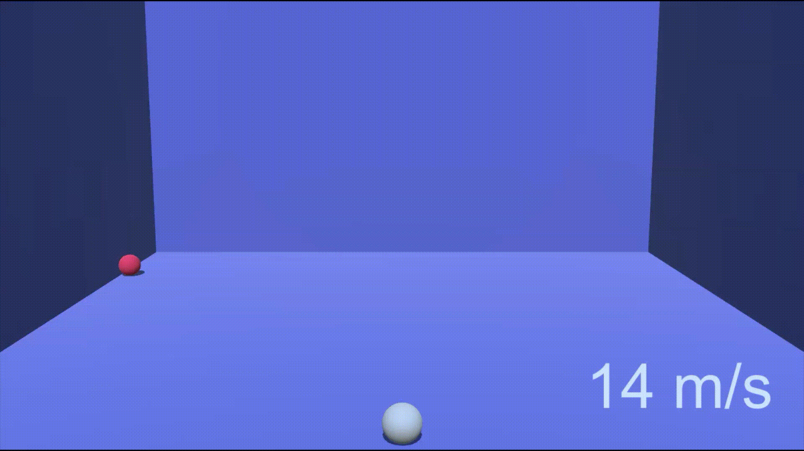
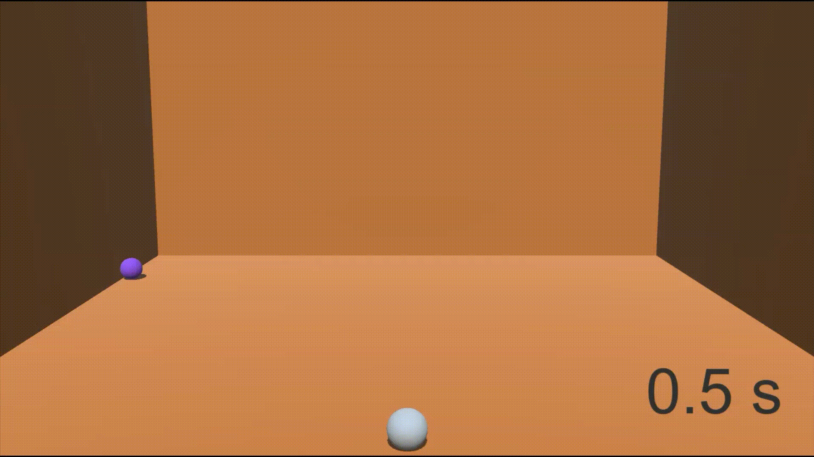

# Projectile Shooting

Versatile solution that takes both velocity and acceleration into consideration for accurate projectile targeting.

The mathematical explanation by [DMGregor](https://gamedev.stackexchange.com/users/39518/dmgregory) can be found [here](https://gamedev.stackexchange.com/a/149612/173615).

## Main Functions (from Ballistics class)

- Vector3 **CalculateShootVelocity**(Vector3 targetStartPos, Vector3 targetVelocity, Vector3 targetAcceleration,
        Vector3 projectileStartPos, Vector3 projectileAcceleration, **float projectileSpeed**, out float duration)

> **1.** Shooting at the target a different **speeds**.

- Vector3 **CalculateShootVelocity**(Vector3 targetStartPos, Vector3 targetVelocity, Vector3 targetAcceleration,
        Vector3 projectileStartPos, Vector3 projectileAcceleration, **float duration**)

> **2.** Shooting at the target, hitting it after different **durations**.

## How To Get Started

**Clone or download** this repository and open the project in Unity. Alternatively, you can **copy the contents** of `Assets/Ballistics` to an **existing project**.

The **scenes** used for the **GIFs** are available in the `Assets/Examples` folder. Just hit the **Space Bar** in play mode to test it.

Note: This project is using the **Unity 2022.3 LTS** version.

